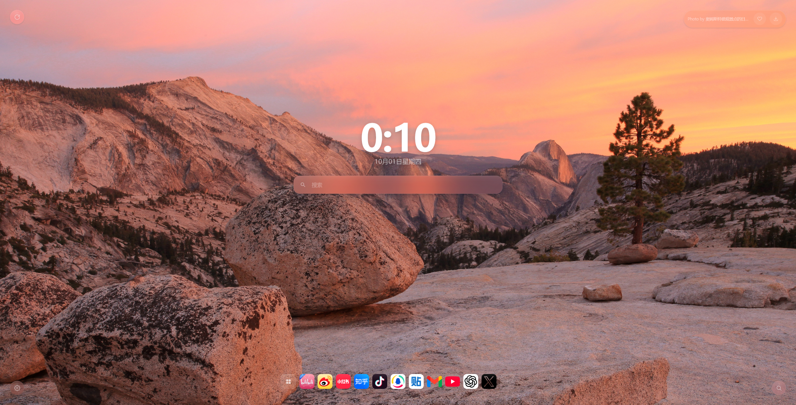
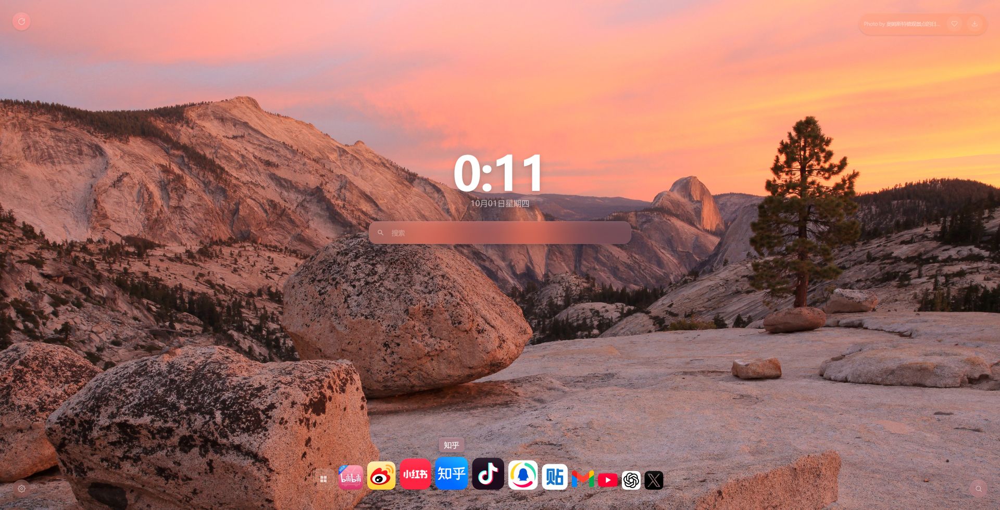
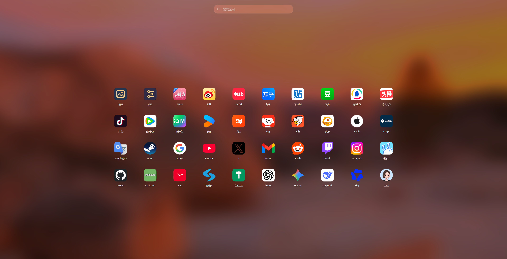
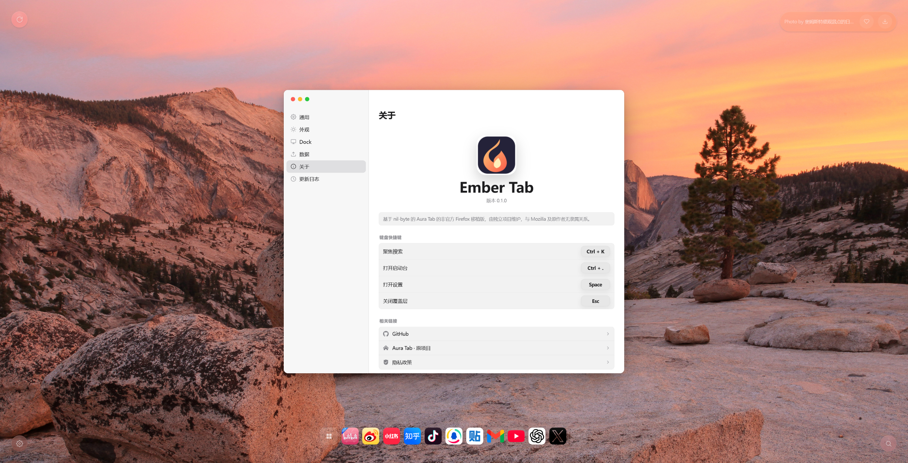
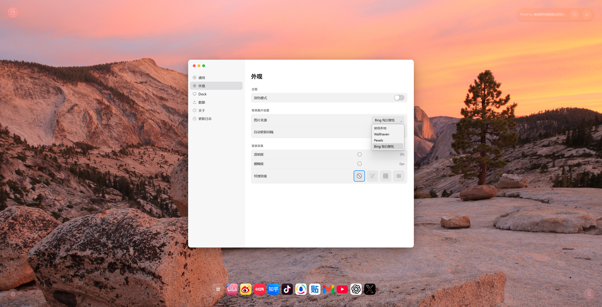

# Ember Tab

An unofficial Firefox port of [Aura Tab by nil-byte](https://github.com/nil-byte/aura-tab), based on version 3.5.3, commit a706cee56e43b80777de697dd4462083b1f97ef8. Independently maintained; not affiliated with Mozilla or the original author. The upstream [MIT license](LICENSE) and copyright are preserved.

基于 Aura Tab 的非官方 Firefox 新标签页扩展，保留快捷链接、Dock、搜索、书签导入、本地／在线壁纸、照片、备份与 WebDAV。独立维护，名称为 **Ember Tab**。


**0.1.3 图标修复与候选选择更新已在 GitHub 发布。** 构建包与源码见 [GitHub 0.1.3 发布](https://github.com/LJure/ember-tab/releases/tag/v0.1.3)，完整商店材料与步骤见 [手动上传指南](docs/THIRD_UPDATE_STORE_GUIDE.md)。Firefox 商店本轮由维护者手动更新；GitHub 发布不代表商店已完成审核。GitHub ZIP 用于商店上传或开发者临时加载，长期安装仍推荐商店签名版。

[](https://addons.mozilla.org/zh-CN/firefox/addon/ember-tab-firefox/)

## 安装与迁移

### Chrome 自用版

Chrome 自用迁移已完成，采用本地加载、手动更新。运行 `npm ci` 后执行 `npm run package:chrome:self-use`，生成 `dist/ember-tab-0.1.3-chrome-self-use.zip`；解压后在 `chrome://extensions/` 开启开发者模式，加载包内直接含 `manifest.json` 的 **chrome 目录**。也可直接加载本仓库的 `dist/chrome/`。

固定 ID 为 `ikjonccnpooflmknleniaiicpogiaieb`。保持开发者模式开启和加载目录存在；更新前导出备份，保留公钥，替换同一目录的文件后点击“重新加载”。早期无固定 ID 的 Chrome 包须先导出 ZIP，再迁移到固定 ID 版。安装、Firefox 迁移、手动更新和恢复见 [自用说明](docs/CHROME_SELF_USE.md)，测试范围见 [验证记录](docs/CHROME_SELF_USE_VALIDATION.md) 和 [完整迁移记录](docs/CHROME_MIGRATION.md)。Chrome 包为本地构建物，本轮未提交 Chrome 商店；GitHub 发布附件为 Firefox 更新材料。

### Firefox 附加组件商店（推荐）

支持桌面版 Firefox 140 及以上版本。点击上方徽标，或直接打开 [Firefox 附加组件商店中的 Ember Tab](https://addons.mozilla.org/zh-CN/firefox/addon/ember-tab-firefox/)。

1. 在 Firefox 中打开商店页面，点击“添加到 Firefox”。
2. 阅读安装提示，确认权限与数据说明后点击“添加”。
3. 打开一个新标签页，即可使用 Ember Tab；若 Firefox 询问是否保留新的新标签页设置，选择保留。
4. 点击左下角设置按钮，或按空格键打开设置，调整外观、壁纸和 Dock。

商店安装可长期使用，并由 Firefox 管理扩展更新。

### 手动安装（开发者临时加载）

需要 Node.js 24 和 npm。可克隆本仓库，或通过 GitHub 的“Code → Download ZIP”下载源码并解压。

1. 打开终端，进入包含 `package.json` 的项目根目录。
2. 安装依赖并构建 Firefox 扩展：

   ```sh
   npm ci
   npm run build:firefox
   ```

3. 在 Firefox 地址栏输入 `about:debugging#/runtime/this-firefox`，进入“此 Firefox”页面。
4. 点击“临时载入附加组件”，选择构建生成的 `dist/firefox/manifest.json`。
5. 打开新标签页，查看 Ember Tab。修改源码并重新构建后，可在调试页点击“重新载入”。

临时加载的扩展会在 Firefox 重启后移除，需要重新载入。日常使用推荐商店安装。详细说明见 [构建与分发文档](docs/DISTRIBUTION.md)；临时加载步骤也可参考 [Mozilla 官方说明](https://extensionworkshop.com/documentation/develop/temporary-installation-in-firefox/)。

### 从 Aura Tab 迁移

1. 在 Aura Tab 的“设置 → 数据管理”中导出 ZIP 备份。
2. 打开 Ember Tab 的“设置 → 数据管理”，导入该 ZIP。
3. 导入完成后，核对快捷链接、Dock、设置和本地图片；如果 Ember Tab 已有数据，请先导出一份当前备份再恢复。

Aura 数据通过 ZIP 导入；用户已验证 Brave／Aura 3.5.3 的 59 链接、37.1 MB 备份、新版真实 WebDAV、Firefox 账号设置／链接同步、慢图床与自动图标尺寸修复，以及 Wallhaven 私有收藏集和 Pexels 真实取图。128 MiB 合成数据备份往返已通过；跨设备冲突合并延期至后续版本，长期轮换留待上线后持续验证，正式签名升级仍待验收。恢复不具备跨数据库与 storage 的全局回滚。

普通包要求图床、在线服务和 WebDAV 使用 HTTPS。仅本机集成测试可以单独生成带 `-test-http` 标记的包。Chromium 历史配置不是 Firefox 安装入口。

## 0.1.3 更新

- 自动取图保留大页面中的图标声明，优先可用原站图，匹配浅深色图标，公共 HTTP 链接先尝试 HTTPS。
- 新增“选择图标”：编辑链接 → 自动 → 选择图标，比较来源和实际尺寸。点击应用本机选择，普通保存和重载保留；刷新缓存恢复自动选择。
- 修复相册全屏查看器的弹层／Escape 行为；共享构建支持 Firefox 和 Chrome 自用版。
- Firefox 权限及固定 ID 保持不变，隐私页补充主动取候选的说明。

验证与发布见 [0.1.3 记录](docs/THIRD_UPDATE_RELEASE.md)，商店手动更新见 [上传指南](docs/THIRD_UPDATE_STORE_GUIDE.md)。历史图标诊断见 [候选选择记录](docs/CHROME_ICON_CHOOSER.md)。

## 0.1.2 更新

- 更新插件图标，采用新的蓝色设计，适配普通与高像素密度工具栏。
- 自动更换壁纸时，左上角刷新按钮持续旋转，更新完成或失败后停止。
- 搜索历史／联想面板平滑展开和收起；删除记录时淡出、补位并调整面板高度，减少闪烁。支持快速关闭再打开及减少动态效果设置。
- 改善等待联想更新时的键盘选择，以及异步删除后的焦点行为。

验证见 [第二次更新记录](docs/SECOND_UPDATE_IMPLEMENTATION.md)。

## 0.1.1 更新

- 恢复原版相册和设置图标。
- 可选搜索历史，支持逐项删除与清空，只保存在本机，不参与同步、迁移或备份。
- 可选实时搜索联想；浏览器默认、搜狗和 Ecosia 使用独立来源选择，其他支持的引擎跟随搜索框选择。历史与联想默认关闭，无痕窗口禁用。
- 外观设置可调历史／联想面板不透明度及模糊强度，提供即时预览与恢复默认。新标签页保持面板收起。
- 新标签页打开搜索结果后，清空原页面搜索框并移除焦点。

开关和联想来源位于“设置 → 通用 → 搜索”，面板样式位于“设置 → 外观”。验证与发布边界见 [实现记录](docs/FIRST_UPDATE_IMPLEMENTATION.md) 和 [0.1.1 发布记录](docs/FIRST_UPDATE_RELEASE.md)。

## 展示截图

### 新标签页



### Dock 悬停效果



### 启动台



### 关于与快捷键



### 壁纸与外观设置



## 文档

- [素材、网络和服务条款审计](docs/M5_ASSET_AND_NETWORK_AUDIT.md)
- [动态 HTML 警告复核](docs/M5_HTML_AUDIT.md)
- [安装、迁移、构建与分发边界](docs/DISTRIBUTION.md)
- [隐私说明 / Privacy](privacy.html)
- [第三方许可](THIRD_PARTY_NOTICES.md)
- [M4 数据可靠性](docs/M4_DATA.md) · [图标恢复](docs/M4_ICON_RECOVERY.md)

